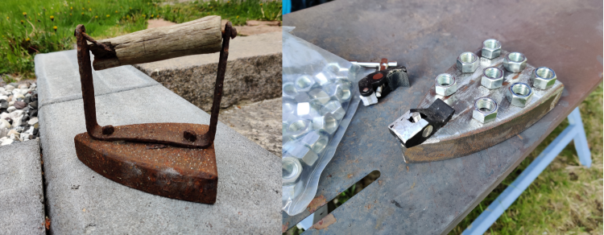
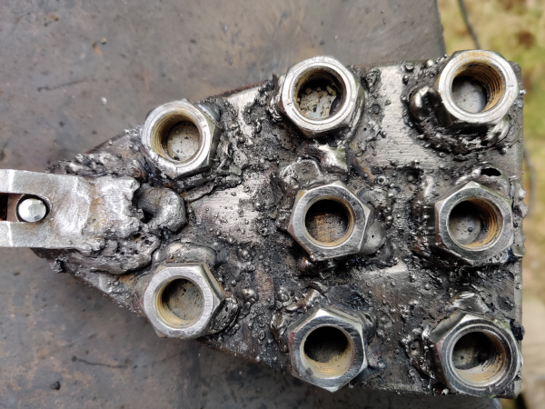
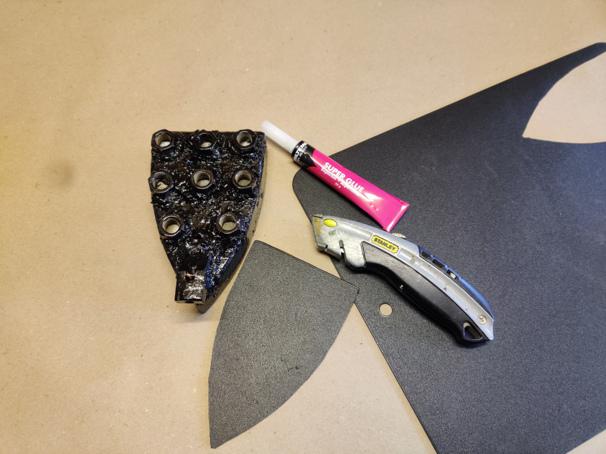
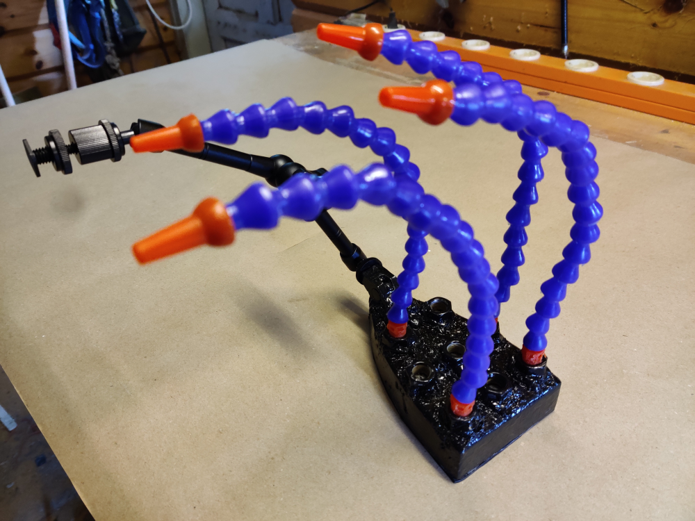
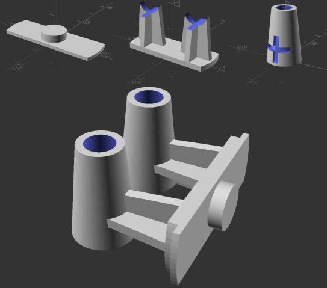
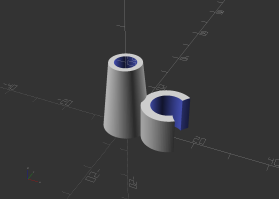

# ironBench
I always find myself with too little desk space for doing electronics work so
I built this iron bench. Its easy to move around and can just be lifted away
when not needed.

This project contains instructions on how to build + 3d printable accessories.

The build is cheap and very easy but do require (minor) welding skills.

The most difficult part of the project was telling my wife she could not use
the iron as patinated garden decoration :disappointed:.

# Parts list (YMMV)
1. A rusty iron
2. 8 x Nuts, 1/2"-UNF (most flexible water pipes uses this dimension)
3. Flexible water pipes (search ebay/Bangood etc.)
4. 11" Adjustable Friction Articulating Magic Arm (again search..)
5. Thin plastic board + superglue
6. Black metallic paint

# Main tools
1. Angle grinder
2. Welder (any type I guess)
3. 3d printer (for accessories)

# Build instruction
Use an angle grinder and remove the handle and most of the rust.
Cut the table clamp (that should come with 4.) in half.



Fit the half clamp (the one that has the mounting hole) and the nuts onto the
iron according to picture.

Weld the items onto the iron with a cheap stud welder. As the iron is pretty
thick, set the stud welder at its max (180A in my case). This made the weld
seams come out even and smooth.. :relieved:




After welding (and cooling off), quickly paint the result with black metallic
paint.

Add a plastic board using superglue. Underneath.



# Mounting
The flexible water pipes was difficult to screew into the nuts. "Inch
threading" comes in two flavors UNC (coarse threading) and UNF (fine
threading). I'm pretty sure that both nuts and the water pipes uses UNF but
still I had to hunt the water pipe threads with a seperate nut before screwing
them onto the iron.

Mount the "articulated magic arm" to its (half) clamp. Note. by placing the
iron so that the arm has a natural clockwise momentum (like picture), there is
no risk of it unscrewing when mounted.



# Accesories
These are all 3d printables parts that I added. All parts are provided as stl
files and Openscad (if modifying is needed).

## Brymen holder
I was happy to find that the water pipes are really stiff so maybe they could
hold my big Brymen 869s multimeter? Yes, at least if two are used.

Brymen has a kind of bajonett mount, so with Openscad I made an adapter to fit
the Brymen onto the water pipes. For easier print its made of three seperate
parts which are glued togther according to picture.




In addition I made an (optional) knob for the probes. The knob requires
a submodule so if modifying first do:
```
git submodule update --init
```

## Probe holder
Again available as Openscad design, seems to fit most of my probe. Printed as
a single part.




